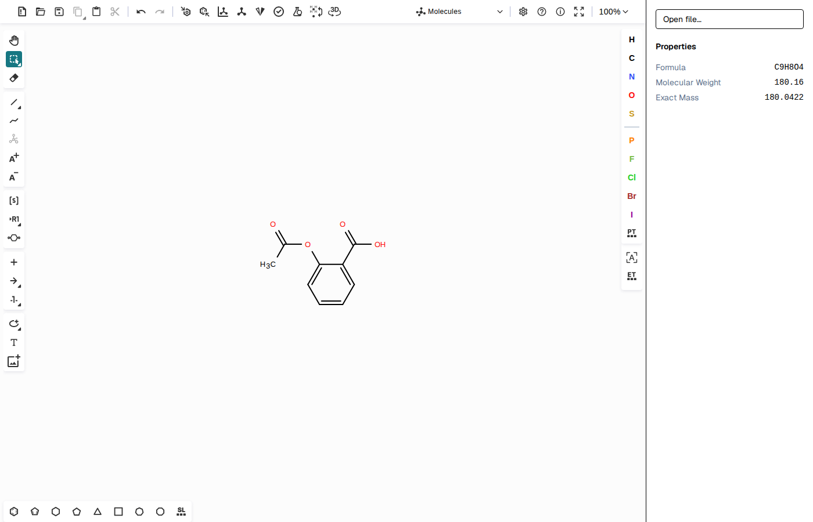

# DChemInk

Open-source web-based chemistry drawing tool. Browser-only. No backend, no AI, no fees.



## Develop

```bash
pnpm install
pnpm dev               # http://localhost:5173
pnpm test              # unit tests (Vitest)
pnpm test:e2e          # Playwright E2E
pnpm build             # production bundle
```

## v0.3 — polish + file import

- **File import** — "Open file…" button in the sidebar accepts CDXML, MOL, SDF, SMILES, InChI, KET. Ketcher sniffs the format automatically.
- **Bundle code-splitting** — Ketcher, RDKit, and React are now isolated chunks. App updates no longer bust Ketcher's 24 MB cache.
- **Cleaner deps** — dropped 7 scaffold leftovers (shadcn, radix-ui, lucide-react, class-variance-authority, clsx, tailwind-merge, tw-animate-css). Removed ~4,000 lines of lockfile churn.

## v0.2 — keyboard-driven editing

Single-key atom editing. Press `?` for the searchable hotkey overlay (the bindings are defined in `src/hotkeys/hotkeys.json`).

- **LABELTEXT** — `m` → Me, `e` → Et, `P` → Ph, `H` → Cbz, `Q` → Fmoc, `y` → Boc, … Select an atom, press the key; label round-trips through CXSMILES.
- **SPROUT** — `3` → benzene, `6` → cyclohexane, `7` → cyclopentane, `2` → carbonyl, `J` → phenyl. v0.2 adds the substructure as a separate fragment; bonded sprouts come in v0.4.

## v0.1 — scaffold

Vite + React + TS + Ketcher 2D canvas + RDKit-JS + live PropertiesPanel (MW / formula / exact mass).

## License

MIT (this code). Ketcher = Apache 2.0; RDKit-JS = BSD-3.
